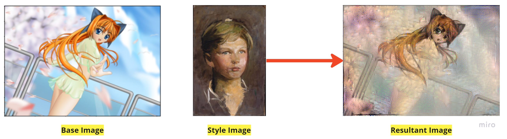
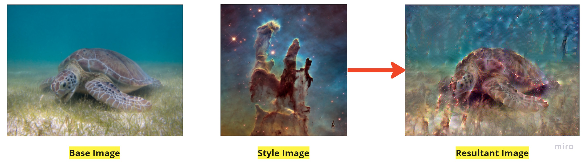
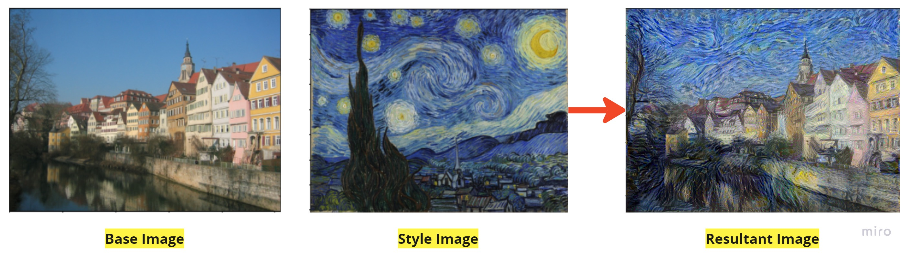
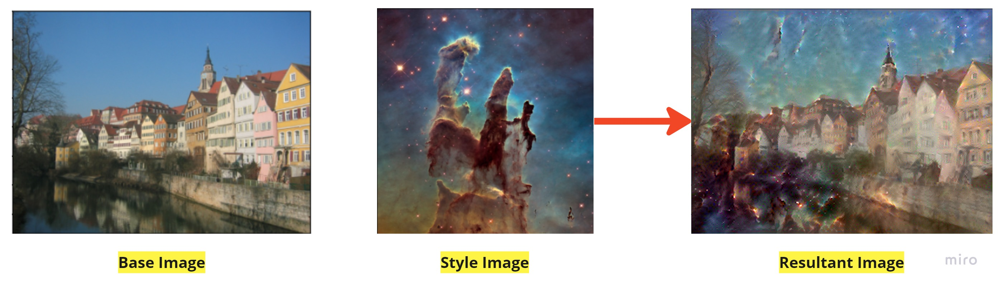

# Dashtoon_GenAI_Assignment

* **Name:** Kumar Abhishek
* **Institute:** IIT Kanpur
* **Interests:** Generative-AI, NLP, CV, ML/DL

<code>
* Notebook link: [Click Here](https://colab.research.google.com/drive/1vqg6me0YpLqrZvg3vDFuXgm_30fTCzBa?usp=sharing)
* Data Source: [Click Here](https://colab.research.google.com/corgiredirector?site=https%3A%2F%2Fcommons.wikimedia.org%2Fwiki%2FMain_Page)
</code>

* **Input** : Two images, one having the base/content and other with artistic style
* **Output** : A single image with the content of the first one and the style of the second image

**Steps Outline**

* Importing Necessary Libraries
* Downloading Sample Images
* Plotting & Comparing Base Image and the artistic style image
* Preparing Data
* Building Model
* Calculating the content and style loss
* Applying style transfer
* Calculating gradient descent and total loss
* Displaying and comparing the final result

**Results of model execution on some sample images👇**

* *Example 1*

* *Example 2*

* *Example 3*

* *Example 5*

